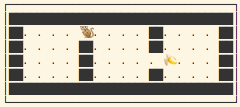

# Lab 01: Searching as Problem Solving

In this lab we are going to look at search techniques for problem solving. We consider a grid world environment in which an agent can move and interact for achieving a goal. We assume complete knowledge on the configuration of the environment and the task is to use **offline searching techniques** to build a plan that can be used to control the agent.

Your goal is to write the code to do implement general search techniques introduced in the lectures, and evaluate them for a specific problem. Bear in mind that the code you'll write will be useful for the next assignments as well, so it's important you make it general enough.

## Setup the coding environment

### Method 1: Conda

- For this assignment you should work in the `search` folder.
- Make sure you create the virtual environment `iap` for the labs, in the root of the repository there's the file `environment.yml` with the list of the required packages. To set it up using `conda` you should run the command:

~~~
    conda env create --file environment.yml
~~~

This will initialise a new Conda environment with the right name and the packages listed in the `environment.yaml` file. This operation doesn't need to be done more than once (unless you delete the environment). In the case that you'll need to add more packages, or some of the packages need to be updated you could just update it using the command `conda env update --file environment.yml --prune`.

- Activate the environment with `conda activate iap`.

### Method 2: Conda + Mamba

If Method 1 does not terminate, or terminates with an error, you can try to use Mamba for the creation of the virtual environment:

1. Install Mamba:

~~~
conda install mamba -n base -c conda-forge
~~~

2.  Create the virtual environment

~~~
mamba env create --file environment.yml && conda clean -tipy
~~~

Both Method 1 and 2 above will initialize a new Anaconda environment with the right name and the packages listed in the environment.yaml file. This operation doesn't need to be done more than once (unless you delete the environment). In the case that you'll need to add more packages, or some of the packages need to be updated you could just update it using the command `conda env update --file environment.yml --prune`

If you won't use Anaconda you can create a virtual environment by hand or using any other virtual environment manager (see [The Hitchhiker's Guide to Python!](https://docs.python-guide.org/dev/virtualenvs/) for details), taking the list of required packages from `environment.yaml`.

## The EaterWorld game

To experiment with offline search we apply the technique for building a player for a simple game based on the _Grid World_ idea: an environment composed by tiles where an agent moves and interact with objects. In our case the agent is a monkey and its goal is to consume all the bananas in a given world configuration. E.g.:

Each turn the monkey can move in the four directions _(N,S,E,W)_ of one step, and when moves into a tile with the banana it eats it (no action is necessary). Each action costs 1 and a banana gives 10 points. The goal is to eat all the bananas with the maximum outcome. When the monkey hit the boundaries or one of the blocks, it doesn't move (the cost is still 1).

The monkey perceives its location and whether there's still food in the world.

E.g. the sequence of actions _E, S, S, E, E, E, E, E_ in the above example terminate the game with an outcome of 2.

The `data` folder contains a few world configurations, to play with them you can use the `gridrunner` script installed by the [wumpus](https://gitlab.inf.unibz.it/Davide.Lanti1/wumpus-tessaris) package:

~~~
gridrunner --world EaterWorld --entry wumpus:UserPlayer data/eater-world_1.json
~~~

## Structure of the code

The package [wumpus](https://gitlab.inf.unibz.it/Davide.Lanti1/wumpus-tessaris) implements the GridWorld engine and the API for building players. For this lab we focus on the `EaterWorld` world and `OfflinePlayer` player.

To write a player you need to subclass `OfflinePlayer` implementing its methods. The dynamics of the game from the point of view of the player is as follow:

1. At the beginning the `OfflinePlayer.start_episode` method is called with a copy of the initial world; the method should return a sequence of `Eater.Actions`, which is the plan to "solve" the game.
2. The game engine uses the list of actions to play the game and
3. At the end of the game the `OfflinePlayer.end_episode` method is called with the outcome of the episode.

The code in [examples/eater_usage.py](https://gitlab.inf.unibz.it/Davide.Lanti1/wumpus-tessaris/-/blob/master/examples/eater_usage.py) shows an example of the use of the API. The example is also showing you how to inspect the world to discover the initial position of monkey and bananas, as well as the size and location of the blocks. You can use the [pydoc](https://docs.python.org/3/library/pydoc.html) command to inspect the API (most of the Python IDE provide the description of the classes), e.g.:

~~~
pydoc wumpus.gridworld.GridWorld
~~~

## Tasks

Your task is to implement a player that perform an offline search for a sequence of moves to solve the game and then simply execute them when asked via the `play` method. In this case the feedback shouldn't be necessary during the game.

Your code **must** be runnable via the `gridrunner` script which takes as input the reference to the class implementing the player. By default the script adds the current directory to the Python search path ([sys.path](https://docs.python.org/3/library/sys.html#sys.path)) but an alternative path could be added with the `--path` option. For example the player in [examples/eater_usage.py](https://gitlab.inf.unibz.it/Davide.Lanti1/wumpus-tessaris/-/blob/master/examples/eater_usage.py) could be run using:

~~~
gridrunner --world EaterWorld --entry eater_usage:GooPlayer --horizon 5 eater-world.json
~~~

In the `data` directory there are definitions for different worlds, and you should (at least) try your solution with them.

The repository [aima-pseudocode](https://github.com/aimacode/aima-pseudocode) contains the description of the algorithms described in the textbook, and you can use it to inspire your coding. The focus here is on understanding how to apply the techniques to our problem rather than being innovative on these standard algorithms.

## Uninformed search

You should implement code for iterative deepening and uniform cost search, and apply them to the EaterWorld problem. Your code should measure the efficiency of the algorithms in terms of visited nodes in order to compare the different techniques.

## Informed search

You should implement the A* algorithm and apply to the EaterWorld problem. Make sure that your implementation can be parametrised by the heuristic function so you can adapt it to different problems. Also in this case your code must be instrumented in order to be capable of measure the number of visited nodes.

In the initial problems there is just one location with food, so as a starting point you can adapt your heuristics to handle this specific case. Problems with an arbitrary number of food locations require more sophisticated heuristics.

## Evaluate your code

Compare the different methods in terms of number of visited nodes (memory usage and running time can be easily measured on Unix based systems via [time](https://man7.org/linux/man-pages/man1/time.1.html) command).

Efficiency of different heuristics should be measured in terms of visited nodes as well.

## Submission

Write a `SOLUTION.md` file in the `search` directory describing your code and how to use it (the format is a lightweight markup language called [Markdown](https://gitlab.inf.unibz.it/help/user/markdown.md) which gets nicely rendered by the GitLab file viewer). Then, push your solution to the GitLab server.

You should thoroughly describe your code and the results of your evaluation. If you prefer to keep a small `SOLUTION.md` file you can also include a separate documentation file using the format you prefer (e.g., pdf).

Since it's meant as a refresh and a way of getting acquainted with the infrastructure **this lab will not be part of the evaluation!**
