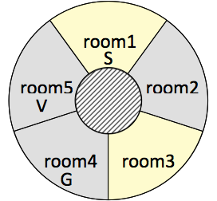

# Lab 03: planning with PDDL

During this lab you will familiarise with a state of the art planner ([Fast Downward](https://www.fast-downward.org/)) and the de facto standard language for modelling planning problems in PDDL. More details on modelling using PDDL can be found in [LearnPDDL](https://fareskalaboud.github.io/LearnPDDL/) and [Writing Planning Domains and Problems in PDDL](http://users.cecs.anu.edu.au/~patrik/pddlman/writing.html); while the [classical-domains](https://github.com/AI-Planning/classical-domains) repository includes several examples.

Credits for most of the exercises go to [Gabriele Röger](https://ai.dmi.unibas.ch/people/roeger/) and [Thomas Keller](https://ai.dmi.unibas.ch/people/tkeller/index.html).

## Setup the environment

### Setup the coding environment

For this lab, you can use the virtual environment `iap` which contains all the packages that we will use throughout the entire course.

~~~
conda activate iap
~~~

- For this assignment you should work in the `planning` folder.
- To verify that the planner has been correctly installed, run the command (after the environment has been activated):

~~~
fast-downward --help
~~~

if it doesn't work, then you should install the planner manually, see next section for details.

## Manually install the Fast Downward planner

The conda environment should include the pre-compiled planner, if it's working as expected (see above) then you can skip this section. If you're not using `conda` or for some reasons (that is, if it doesn't work on your computer), you can install it by following the directions below.

The first way, would be to rely on `pip`:

~~~
conda activate iap
pip install --no-compile downward-dlr
~~~

See [PyPi](https://pypi.org/project/downward-dlr/) page for details. The `--no-compile` option, preventing python byte code generation, is essential! Mind that, during the installation, the C++ code of the planner will be compiled, so the prerequisites detailed here[(https://github.com/aibasel/downward/blob/main/BUILD.md)] must be satisfied.
A second way would be to follow the instructions in the [Quickstart guide](https://www.fast-downward.org/QuickStart).

Finally, you might attempt at compiling the source code yourself, by following the instructions in [this page](https://github.com/aibasel/downward/blob/main/BUILD.md).

If you installed the planner via `pip`, you should have the command `fast-downward` in your path; if you compiled the source, you'll have to use the `fast-downward.py` script, as explained in [FD website](https://www.fast-downward.org/PlannerUsage).

## Editing PDDL files

You can use the online PDDL editor available on [Planning.Domains](http://editor.planning.domains/) which has an integrated solver. Mind that the solver is limited to 10 seconds runs and you cannot configure its parameters.

For _Visual Studio Code_ you can use the excellent [PDDL extension](https://marketplace.visualstudio.com/items?itemName=jan-dolejsi.pddl). Similar plugins with syntax highlighting are available for [Sublime Text](https://github.com/Pold87/myPDDL) and [Atom](https://github.com/Pold87/myPDDL-Atom).

There are some PDDL example files available on the GitHub [vscode-pddl-samples](https://github.com/jan-dolejsi/vscode-pddl-samples/) repository. More resources and documentation are available on the [Planning.Wiki](https://planning.wiki/).

## Exercise 1: Know the FD planner

In this first exercise we will use two pre-defined domains based on the [sliding puzzle](https://en.wikipedia.org/wiki/Sliding_puzzle) problem to run the planner and verify the effect of different heuristics.

### Exercise 1.a:

The directory `tile` contains a PDDL formulation of the 15-Puzzle (`puzzle.pddl`, `puzzle01.pddl`) and of the weighted 15-Puzzle (`weight.pddl`, `weight01.pddl`). To run Fast Downward, use the command `fast-downward` (if you manually compiled the planner you might have to use the `fast-downward.py` file in the distribution directory) with the corresponding domain and problem files, specifying the search algorithm and the heuristic (see [FD usage](https://www.fast-downward.org/PlannerUsage) documentation for details). Example for the 15-Puzzle, [greedy best first](https://www.fast-downward.org/Doc/SearchEngine#Eager_best-first_search) search and the FF heuristic:

~~~
fast-downward puzzle.pddl puzzle01.pddl --heuristic "h=ff()" --search "eager_greedy([h])"
~~~

at the end of the search the planner will show some statistics regarding the search, e.g.:

~~~
Plan cost: 241
Expanded 2753 state(s).
Reopened 0 state(s).
Evaluated 5945 state(s).
Evaluations: 5945
Generated 8807 state(s).
Dead ends: 0 state(s).
Number of registered states: 5945
Int hash set load factor: 5945/8192 = 0.725708
Int hash set resizes: 13
Search time: 0.181587s
Total time: 0.210669s
Solution found.
Peak memory: 4336660 KB
Remove intermediate file output.sas
search exit code: 0
~~~

and the actual plan (if found) is written in a text file named `sas_plan` by default; but you can change that with the `--plan-file` option.

Run Fast Downward on the 15-Puzzle and the Weighted 15-Puzzle, using greedy best first search and different heuristics:

- [FF heuristic](https://www.fast-downward.org/Doc/Evaluator#FF_heuristic): `ff()`;
- [additive heuristic](https://www.fast-downward.org/Doc/Evaluator#Additive_heuristic): `add()`;
- [blind heuristic](https://www.fast-downward.org/Doc/Evaluator#Blind_heuristic): `blind()`

You should read and understand the PDDL formulation of the two versions of the 15-Puzzle problem. How does the costs in `weight01.pddl` affect the solution?

### Exercise 1.b:

Compare the results of different heuristics with respect to time, number of expanded and generated states.

### Exercise 1.c: Glued 15-Puzzle

Consider a modified version of the 15-Puzzle where some tiles are _glued_ to their initial position. Tiles that are glued cannot be moved by any action. Create new domain and problem files `puzzle-glued.pddl` and `puzzle-glued01.pddl` modifying the PDDL formulation of the domain file `puzzle.pddl` and the problem file `puzzle01.pddl` accordingly:

- Introduce an additional predicate GLUED in the domain file that indicates whether a tile is glued or not. Modify the action descriptions such that only tiles that are not glued can be moved.
- Modify the problem file such that tile 6 is glued.
- Run Fast Downward on the Glued 15-Puzzle with greedy best first search and the heuristics from Exercise 1.a. Compare the results with the results for the 15-Puzzle and the Weighted 15-Puzzle with respect to time, number of expanded and generated states.

### Exercise 1.d: Cheating 15-Puzzle

Consider another modified version of the 15-Puzzle where it is allowed to cheat, in the sense that there are actions that

- allow to remove a tile from the frame (leaving the former position of the tile blank), and
- allow to reinsert a removed tile at any blank position.

Create new domain and problem files `puzzle-cheat.pddl` and `puzzle-cheat01.pddl` modifying the PDDL formulation of the 15-Puzzle accordingly. Run Fast Downward on the Cheating 15-Puzzle with greedy best first search and the heuristics from Exercise 1. Compare the results with the results for the 15-Puzzle, the Weighted 15-Puzzle and the Glued 15-Puzzle with respect to time, number of expanded and generated states.

## Exercise 2: Vampire domain

Consider the following planning task:

- You are trapped in the cellar of a building with a switch board full of light switches. In the rooms above you there is a vampire (V). Luckily, there also is a vampire slayer (S) in those rooms. To keep things simple, we consider only room layouts that are circular corridors where each room has a clockwise and an anti-clockwise neighbour.
- The vampire avoids the light: whenever the light in the vampire's room is switched on, it moves to a neighbouring room. If one of the neighbouring rooms is dark, it will move there, preferring the anti-clockwise one if both are dark. If both neighbouring rooms are bright, it will move clockwise.
- The slayer tries to stay in the light. If the light in her room is switched off, she moves to a neighbouring room. She moves clockwise if that room is bright and anti-clockwise otherwise.
- If the two of them meet in a room they will fight. The vampire wins the fight in a dark room unless there is garlic (G) in that room. In bright rooms or in rooms with garlic, the slayer wins.
- All you can do is use the switch board to toggle lights and watch the fight, when it happens. Your objective is to toggle the lights so that the vampire slayer can win the fight.

Example instance with five rooms:

### Exercise 2.a:

The directory `vampire` contains a partial model of this domain. Complete it by adding the effects of `toggle-light` and `watch-fight` operators. You should use just the defined predicates and you don't need to add new operators. Mind that in order to use just the two operators you need to use [conditional effects](https://planning.wiki/ref/pddl/requirements#conditional-effects).

The directory also contains instances which you can use for debugging. Their optimal plan costs should be 6, 4, 7, 5, 4, 12, 11, 10, 13, and 8.

You can compare your work by with the [provided solution](domain_vampire_solution.pddl) (link will be functioning in a few days).

## Exercise 3: Hunt the Wumpus

Model the complete Wumpus problem, i.e. getting out of the cave with the gold. You can look at [Modelling the Wumpus World in PDDL](http://users.cecs.anu.edu.au/~patrik/pddlman/wumpus.html) for inspiration but consider that the rules adopted in the document are slightly different from the ones we're using (list the differences).

To model the problem you need to consider the different action costs. To see how this can be modelled in PDDL, consider the weighted examples in the first exercise. For more details, look at the section **Sum of Action Costs** in [Writing Planning Domains and Problems in PDDL](https://users.cecs.anu.edu.au/~patrik/pddlman/writing.html)

Write your solution files in the `wumpus` directory.

### Exercise 3.a:

Model the Wumpus domain by introducing only the actions that the agent can perform and assign them the corresponding costs. Write some simple configurations to test your encoding.

### Exercise 3.b:

Write a (Python) script that creates a problem specification from an arbitrary Wumpus World instance. You should use the `wumpus` package used in the previous labs.

### Exercise 3.c:

Use Fast Downward to find a solution for the different problems and verify them using the Wumpus World. Experiment with different heuristics to see whether there are some better suited for the kind of problem. Be careful that not all heuristics support all PDDL language feature (e.g. conditional effects); see the notes in the heuristic descriptions in the [FD documentation](https://www.fast-downward.org/Doc/Evaluator).

## Submission

Write a `SOLUTION.md` file in the `planning` directory describing your code and how to use it (the format is a lightweight markup language called [Markdown](https://gitlab.inf.unibz.it/help/user/markdown.md)). Then, push your solution to the GitLab server.

You should thoroughly describe your code and the results of your evaluation. If you prefer to keep a small `SOLUTION.md` file you can also include a separate documentation file using the format you prefer (e.g. a Jupyter notebook).

This lab will not be part of the evaluation!
